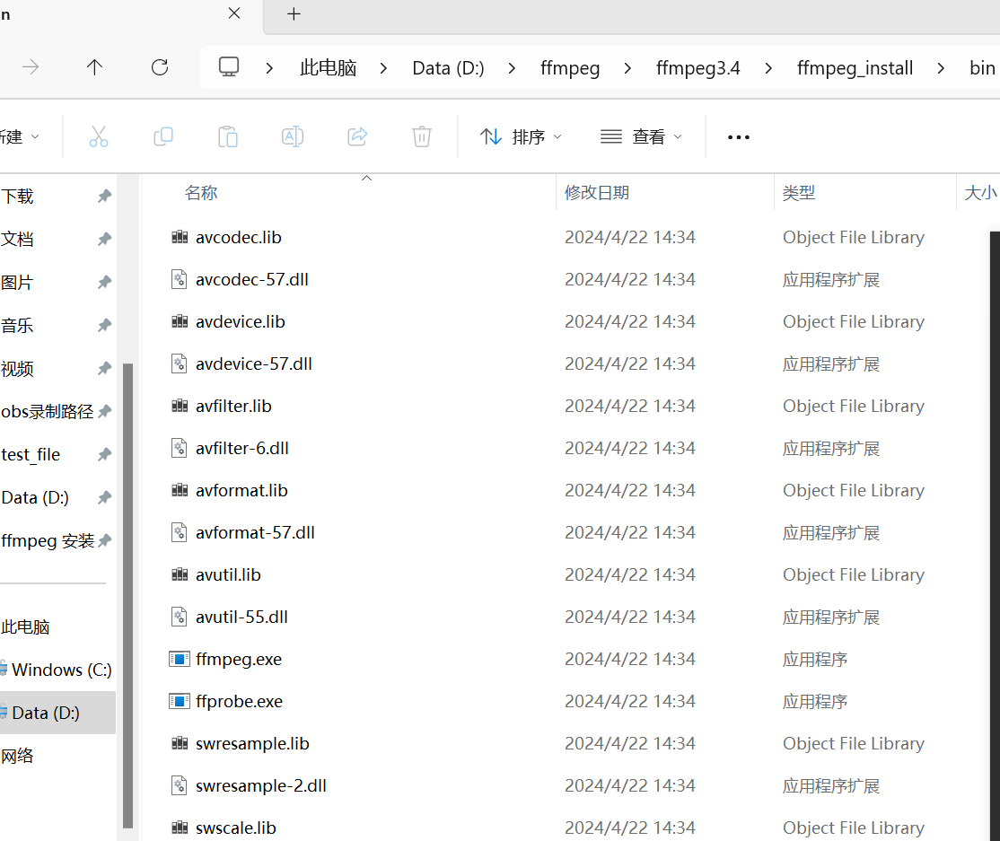

## ffmpeg window 安装
### 目标版本
64 位debug版本的静态库
### 1. 下载MSYS2
 * 地址： https://www.msys2.org/
 * 安装文件: msys2-x86_64-20240113.exe
 * 安装目录: C:\msys64
 * 增加环境变量  C:\msys64\mingw64\bin

### 2. 下载ffmpeg代码
* 源代码地址: https://git.ffmpeg.org/ffmpeg.git  
  `git clone https://git.ffmpeg.org/ffmpeg.git`
* 切换到分支 3.4 的分支
  `git checkout release/3.4`

> 这里也可以直接拉取分支代码
```
git clone -b release/3.4 https://git.ffmpeg.org/ffmpeg.git ffmpeg3.4
```
### 3. 安装工具链
* 管理员身份运行 `C:\msys64\mingw64.exe` 文件
* 在里面执行脚本 `pacman -S mingw-w64-x86_64-toolchain`
 > 按下Enter默认全部安装
* 执行 `pacman -S base-devel'
* 执行 `pacman -S yasm nasm gcc'

### 4. 编译
* 1. 在mingw64.exe 的窗口里面跳转到ffmpeg的目录
* 2. 创建一个编译脚本文件 `touch build.sh`
* 3. 编写编译脚本
```
basepath=$(cd `dirname $0`;pwd)

echo ${basepath}


cd ${basepath}

./configure --prefix=${basepath}/ffmpeg_install --disable-static --enable-shared  --disable-asm --enable-debug=3

make -j4
make install
```

### 5. 补充
* 遇到一个汇编的错误
```
D:\msys2\tmp\ccUxvBjQ.s:2137: Error: operand type mismatch for `shr'
D:\msys2\tmp\ccUxvBjQ.s:2242: Error: operand type mismatch for `shr'
D:\msys2\tmp\ccUxvBjQ.s:2368: Error: operand type mismatch for `shr'
D:\msys2\tmp\ccUxvBjQ.s:2553: Error: operand type mismatch for `shr'
D:\msys2\tmp\ccUxvBjQ.s:2703: Error: operand type mismatch for `shr'
make: *** [ffbuild/common.mak:60: libavformat/adtsenc.o] Error 1
```

我在./configure 里面增加 --disable-asm 就好了


### 使用方式




* 在vsstudio 引入方式
1. 将include 加入c++头文件目录
2. 将bin目录下 .lib 文件加入链接库目录
3. 将bin目录下 .dll 目录拷贝到exe运行目录
4. 在编写helloword的时候，引入头文件的方式
```
extern "C" {
    #include <libavutil/avutil.h>
    #include <libavcodec/avcodec.h>
    #include <libavformat/avformat.h>
    #include <libswresample/swresample.h>
}
```
不然在cpp里面会报找不到符号
